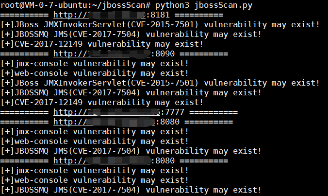

# 一个简单探测jboss漏洞的工具 #

批量探测jboos系列漏洞路径，特别在内网渗透中，提高效率。（此工具仅探测漏洞所在路径，漏洞是否存还需对应exp验证。）

## 介绍 ##

**CVE-2015-7501**

JBoss JMXInvokerServlet 反序列化漏洞。此漏洞存在于JBoss中/invoker/JMXInvokerServlet路径。访问若提示下载JMXInvokerServlet，则可能存在漏洞。

推荐利用工具：
[jexboss](https://github.com/joaomatosf/jexboss "jexboss")	
[JavaDeserH2HC](https://github.com/joaomatosf/JavaDeserH2HC "JavaDeserH2HC")

**CVE-2017-7504**

JBOSSMQ JMS 集群反序列化漏洞。此漏洞与CVE-2015-7501漏洞相似。CVE-2017-7504出现在/jbossmq-httpil/HTTPServerILServlet路径下。若访问200，则可能存在漏洞。

推荐利用工具：
[JavaDeserH2HC](https://github.com/joaomatosf/JavaDeserH2HC "JavaDeserH2HC")

**CVE-2017-12149**

JBoss 5.x和6.x 反序列化漏洞。此漏洞路径存在于/invoker/readonly。若访问此页面为500，则可能存在漏洞。

推荐利用工具：
[JavaDeserH2HC](https://github.com/joaomatosf/JavaDeserH2HC "JavaDeserH2HC")
[jboss-_CVE-2017-12149](https://github.com/yunxu1/jboss-_CVE-2017-12149 "jboss-_CVE-2017-12149")

**管理后台上传war包**

jboss 4.x 之前的版本console路径/jmx-console/。可能存在console未授权访问，可直接部署war包，若需登录，尝试弱口令登录后部署war包。

jboss 6.x 版本console路径/admin-console/。尝试弱口令登录后台上传war包。

常见弱口令：

admin/admin

jboss/admin

admin/jboss

admin/123456

admin/password

## 使用 ##

python3 jbossScan.py 

## 示例 ##

